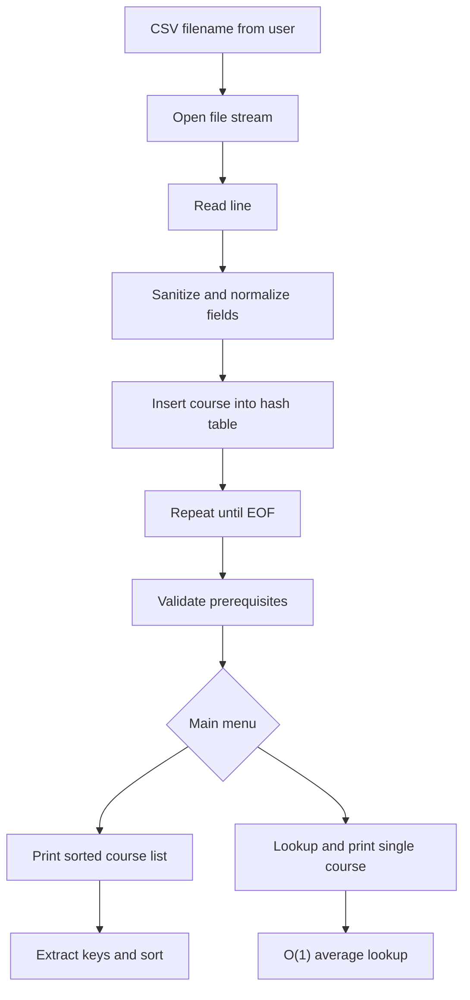

# CS-300 Course Planner - Hash Table Prerequisite Engine

[](https://github.com/bradsaucier/CS300-CoursePlanner/actions/workflows/ci.yml)
[](https://en.cppreference.com/w/cpp/17)
[](./LICENSE)
[](#)

Course Planner is a C++17 console-based course prerequisite analysis tool. It ingests a CSV course catalog, stores records in a custom separate-chaining hash table, validates prerequisite references, and supports fast lookups plus sorted catalog output.

Artifact source: CS-300 coursework focused on data structures, defensive parsing, and complexity tradeoffs.

[Highlights](#portfolio-highlights) | [Quick start](#quick-start) | [CSV](#csv-format) | [Usage](#usage) | [Architecture](#system-architecture) | [Complexity](#design-rationale-and-complexity)
[Structure](#project-structure) | [Troubleshooting](#troubleshooting) | [Appendix A](#appendix-a-project-reflection) | [License](#license) | [Citation](#citation) | [Author](#about-the-author) | [Academic integrity](#academic-integrity)

---

## Portfolio highlights

1. Custom data structure - Hash table implemented from scratch with separate chaining to demonstrate collision handling and manual memory management.
2. Algorithmic efficiency - O(1) average-case course lookup and O(n) catalog validation pass using hash table membership checks.
3. Defensive ingestion - Input normalization (trim and consistent casing) plus UTF-8 BOM stripping to prevent hidden encoding defects from corrupting the first course ID.
4. Console UX and state management - Load-gated menu options prevent invalid operations before the catalog is initialized.
5. CI signal - GitHub Actions build validates the project compiles in a clean environment.

## Quick start

### Prerequisites

1. A C++17 compiler (GCC, Clang, or MSVC).
2. CMake 3.20+.

### Build and run

Run from the repository root so the CSV can be referenced by filename when prompted.

Linux or macOS:

```bash
cmake -S . -B build
cmake --build build
./build/course_planner
```

Windows (MSVC multi-config builds place the binary under Debug or Release):

```powershell
cmake -S . -B build
cmake --build build --config Debug
.\build\Debug\course_planner.exe
```

When prompted for the input file, enter the CSV filename (example: `courses.csv`) if it is in the current working directory, or provide a relative or absolute path.

## CSV format

Each line is:

`courseNumber,courseTitle[,prereq1,prereq2,...]`

Example:

```text
CSCI100,Introduction to Computer Science
CSCI200,Data Structures,CSCI100
CSCI300,Algorithms,CSCI200
MATH201,Discrete Mathematics
```

Notes:

1. Course IDs are treated case-insensitively after normalization (example: `csci300` and `CSCI300` are equivalent).
2. Prerequisites are validated after load. If a prerequisite references a course ID that is not present in the catalog, the loader reports it as missing.
3. UTF-8 BOM is detected and stripped from the first line before tokenization.

## Usage

The application presents a menu-driven console interface:

1. Load data structure (CSV).
2. Print course list (sorted by course ID).
3. Print course (single course view with prerequisites).
4. Exit.

Operational rules:

1. Load must occur before options 2 or 3.
2. Option 2 performs sort-on-demand (extract keys, sort, then print).
3. Option 3 performs a direct hash table lookup for the requested course ID.

## System architecture



## Design rationale and complexity

Design choice summary:

1. Workload is read-heavy after ingestion (many lookups and prints).
2. Hash table provides O(1) average-case lookup, which reduces validation and query cost compared to linear scans.
3. Sorted output is handled separately by extracting keys and sorting on demand.

Complexity analysis:

| Operation | Time complexity (avg) | Notes |
| --- | --- | --- |
| Load catalog | O(n) | Insert n courses into hash table |
| Validate prerequisites | O(n) | Membership checks via hash table |
| Print sorted list | O(n log n) | Extract keys and sort |
| Print single course | O(1) | Average-case hash lookup |

Full writeup:

1. [Complexity analysis](./docs/complexity_analysis.md)

## Project structure

```text
.
|-- .github/workflows/ci.yml
|-- .gitignore
|-- CITATION.cff
|-- CMakeLists.txt
|-- LICENSE
|-- README.md
|-- docs/
|   `-- complexity_analysis.md
`-- src/
    `-- ProjectTwo.cpp
```

## Troubleshooting

| Symptom | Cause | Action |
| --- | --- | --- |
| File fails to load (example: "Could not open file") | CSV path does not exist relative to current working directory | Run from repo root and enter CSV filename, or provide correct relative or absolute path |
| "Format error line X" (or a skipped line) | Malformed CSV row (missing required fields or invalid formatting) | Ensure each line contains at least `courseNumber,courseTitle` and uses commas as delimiters |
| "Missing prerequisite: <ID>" after load | Prerequisite references a course ID not present in the catalog | Add the missing course row to the CSV or correct the prerequisite ID |
| Lookup fails for an ID that appears in the CSV | Hidden BOM on first line or unexpected whitespace or case in input | Confirm encoding is UTF-8 and IDs are consistent; loader strips BOM and normalizes, but validate the source file |

## Appendix A: Project reflection

This section answers the CS-300 Module Eight journal prompts.

<details>
<summary>Open Appendix A</summary>

### 1. What was the problem you were solving in the projects for this course?

The core problem was building an advising support tool that can load course data from a CSV file, store it in memory, and provide two outputs: a full course list sorted alphanumerically by course number, and a single course view that includes its prerequisite course IDs.

Project One required analyzing runtime and memory tradeoffs across candidate data structures (vector, hash table, and binary search tree) to justify an implementation choice. Project Two required turning that analysis into working, testable C++ code that behaves predictably under normal and bad inputs.

### 2. How did you approach the problem? Consider why data structures are important to understand.

I approached the work by starting with required operations and their expected frequency, then selecting a structure that optimizes the dominant operation rather than optimizing everything equally.

In this tool, the dominant operation is lookup by course number. That lookup is used for direct queries and for prerequisite validation. A hash table provides average O(1) lookup, which keeps interactive use responsive and makes the validation pass efficient. The requirement for sorted output is addressed separately by extracting keys and sorting on demand, paying O(n log n) only when the user requests the sorted list.

This reinforced why data structures matter: the structure choice directly affects performance, complexity of implementation, and how easy it is to extend the program later. Choosing the right structure up front reduces both runtime cost and code risk.

### 3. How did you overcome any roadblocks you encountered while going through the activities or project?

Most roadblocks came from input quality and control flow safety.

1. CSV parsing issues - Whitespace drift, missing fields, and inconsistent formatting can break key matching.
2. BOM and invisible characters - UTF-8 byte order mark artifacts can corrupt the first token in a file.
3. Prerequisite integrity - Prerequisites may reference courses that appear later (forward references) or may reference courses that do not exist.
4. User input handling - Invalid menu selections should not poison the input stream or crash the program.

Mitigations:

1. Normalize course IDs (trim and consistent casing), reject malformed lines early, and continue safely.
2. Detect and strip BOM so the first course ID is correct.
3. Load all courses first, then run a post-load integrity check that reports warnings without crashing.
4. Read menu choices by line and parse integers cleanly; handle invalid input with a safe message and re-prompt.

### 4. How has your work on this project expanded your approach to designing software and developing programs?

This work strengthened my habit of designing from requirements and failure modes instead of coding directly toward the happy path.

Project One required me to justify decisions using complexity and operational constraints, not intuition. Project Two made those tradeoffs visible by forcing an implementation that had to handle real input issues, produce correct outputs, and remain understandable to someone reviewing the code later.

I became more systematic in debugging and iteration: isolate the failure, reproduce it reliably, apply the smallest safe change, and re-test the full flow (load, validate, print list, print single course).

### 5. How has your work on this project evolved the way you write programs that are maintainable, readable, and adaptable?

I focused on code that can be maintained by someone other than the author.

1. Separation of concerns - Parsing, storage, validation, sorting, and output are handled in distinct functions.
2. Clear intent in naming - Functions are named after what they do (load, validate, print list, print course).
3. Guardrails by default - File open checks, normalization, and input parsing are treated as baseline requirements.
4. Adaptability - The menu loop and discrete functions make it straightforward to add features without rewriting the loader.

</details>

## License

MIT License. See [LICENSE](./LICENSE).

## Citation

See [CITATION.cff](./CITATION.cff).

## About the author

1. Bradley Saucier, SMSgt, USAF (Ret.)
2. B.S. Candidate, Computer Science (STEM Project Management), Southern New Hampshire University
3. B.A., Columbia University
4. A.A.S., Community College of the Air Force

## Academic integrity

This repository contains coursework artifacts produced for SNHU CS-300 and repackaged for portfolio review. All work in this repository is my own. If you reference or reuse any portion of this work, cite the repository and clearly distinguish original content from derived content.
